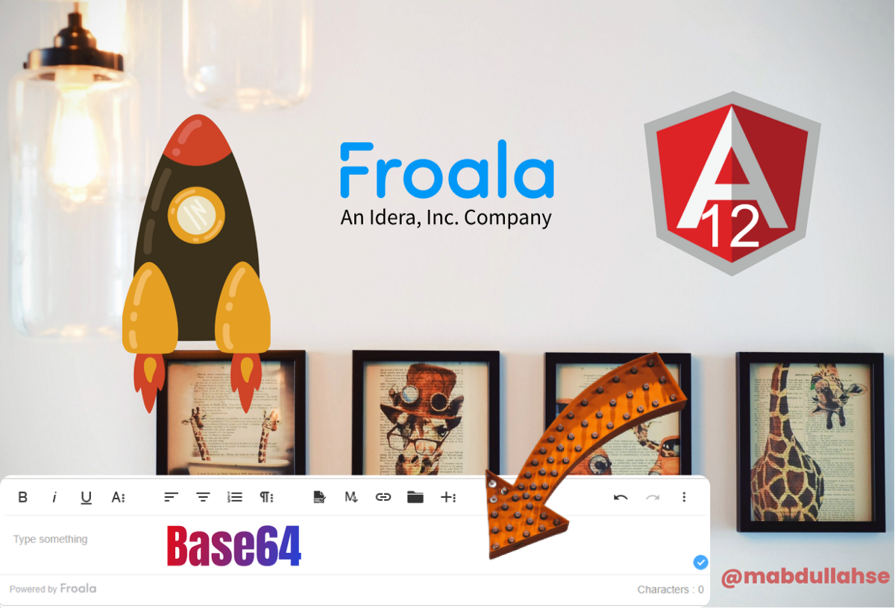

# WYSIWYG HTML Editor | Froala Upload Multiple Images using angular

WYSIWYG HTML Editor is really amazing and cool. Really easy to integrate with existing code with little effort. 
We will be focusing on

## Article includes

- Quick Integration of Editor with Angular.

- How about font setup and default?

- Transformation/convert images into Base64 and bug fixes.
- GitHub Link 🚀

Link is given as [Article attached](https://mabdullah-se.medium.com/angular-12-multiple-image-upload-to-s3-using-dropzone-aws-sdk-190ebe22729f?source=friends_link&sk=ed97c200b42c6acb92aa6dd3ec20fd30)

## License

[MIT](https://choosealicense.com/licenses/mit/)
